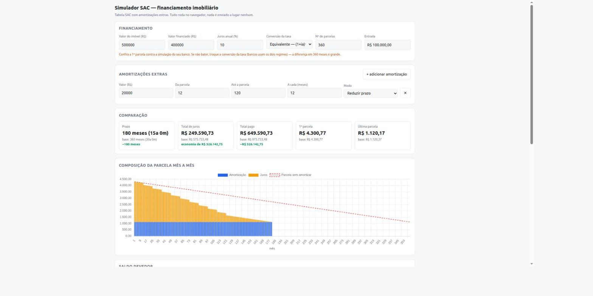
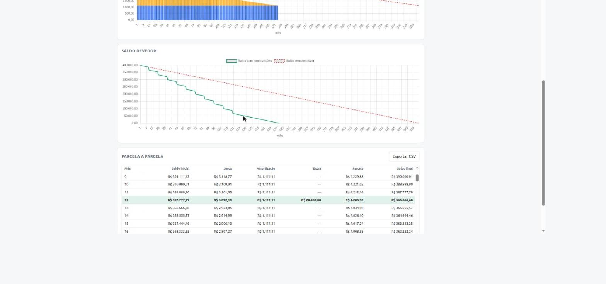

# Simulador de financiamento imobiliário — Tabela SAC

Simulador de financiamento pela Tabela SAC com amortizações extras, para comparar cenários
antes de fechar um financiamento imobiliário.

**Acesse:** https://ramoncgusmao.github.io/simulador-financiamento-imovel/

Tudo roda no navegador. Nenhum dado é enviado a lugar nenhum — os valores ficam apenas no
`localStorage` do seu próprio navegador.

Acima: R$ 400.000 financiados a 10% a.a. em 360 parcelas, com aporte de R$ 20.000 por ano
entre as parcelas 12 e 120 no modo *reduzir prazo*. O financiamento cai de 360 para 180
parcelas e a economia em juros passa de R$ 326 mil. A linha vermelha tracejada é o cenário
sem amortizar, para comparação.

## O que faz

- Tabela SAC completa, parcela a parcela: saldo devedor, juros, amortização e valor da parcela.
- Amortizações extras recorrentes: valor, janela de parcelas (ex.: da 12 à 120) e frequência
  (ex.: a cada 12 meses). Várias regras podem ser combinadas.
- Dois modos de amortização, por regra:
  - **Reduzir prazo** — mantém a amortização mensal e antecipa a quitação.
  - **Reduzir parcela** — mantém o prazo e diminui o valor da parcela.
- Comparação lado a lado com o cenário sem amortizar: prazo, total de juros, total pago.
- Gráficos da composição da parcela e do saldo devedor, com as duas curvas sobrepostas.
- Exportação da tabela em CSV.

O gráfico de saldo devedor mostra os degraus de cada aporte. Na tabela, os meses com
amortização extra ficam destacados — no mês 12 o saldo cai de R$ 387.777,79 para
R$ 366.666,68 com o aporte de R$ 20.000.

## Conversão da taxa

A taxa é informada ao ano e convertida para o mês por um dos dois regimes:

- **Equivalente** (padrão): `i = (1 + ia)^(1/12) − 1`
- **Nominal**: `i = ia / 12`

Bancos usam os dois, e em 360 meses a diferença é grande. Confira a 1ª parcela contra a
simulação do seu banco e ajuste o seletor até bater.

## Rodar localmente

Abra o `index.html` no navegador. Não há build, dependências instaláveis nem servidor.
A única dependência externa é o Chart.js, carregado via CDN.

## Testes

Abra `index.html?test=1` — uma faixa no topo mostra o resultado dos testes do motor de
cálculo (baseline SAC, soma das amortizações igual ao valor financiado, saldo nunca negativo,
efeito de cada modo, quitação antecipada).

## Aviso

Ferramenta de simulação para estudo de cenários. Não considera seguros (MIP/DFI), taxa de
administração nem correção monetária (TR/IPCA), então os valores não reproduzem exatamente o
extrato do banco. Não é recomendação financeira.
